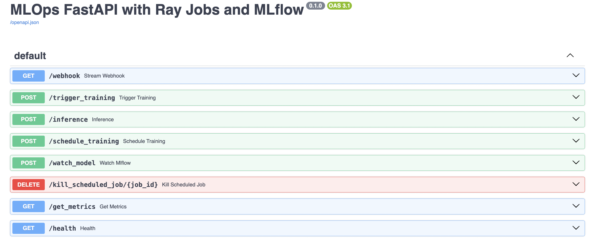
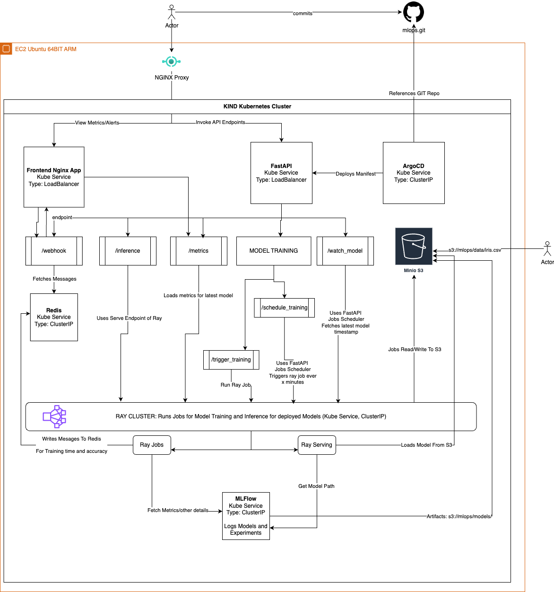
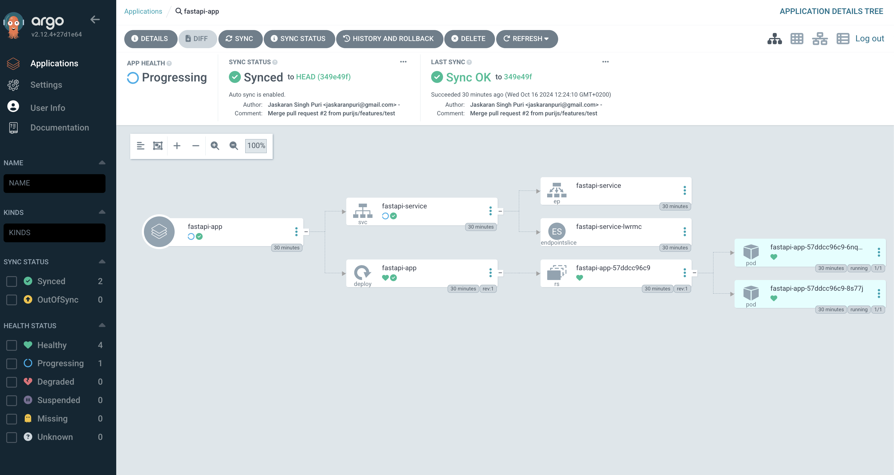
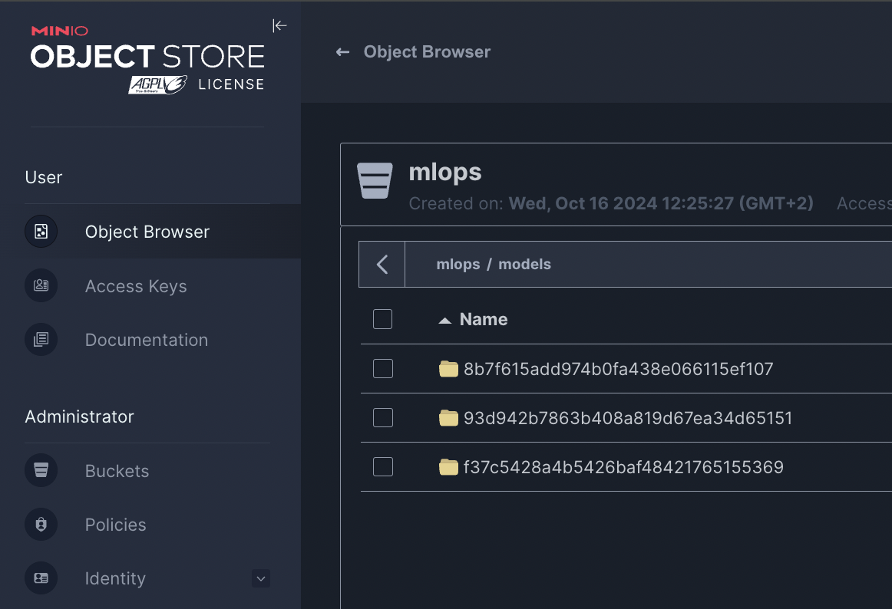
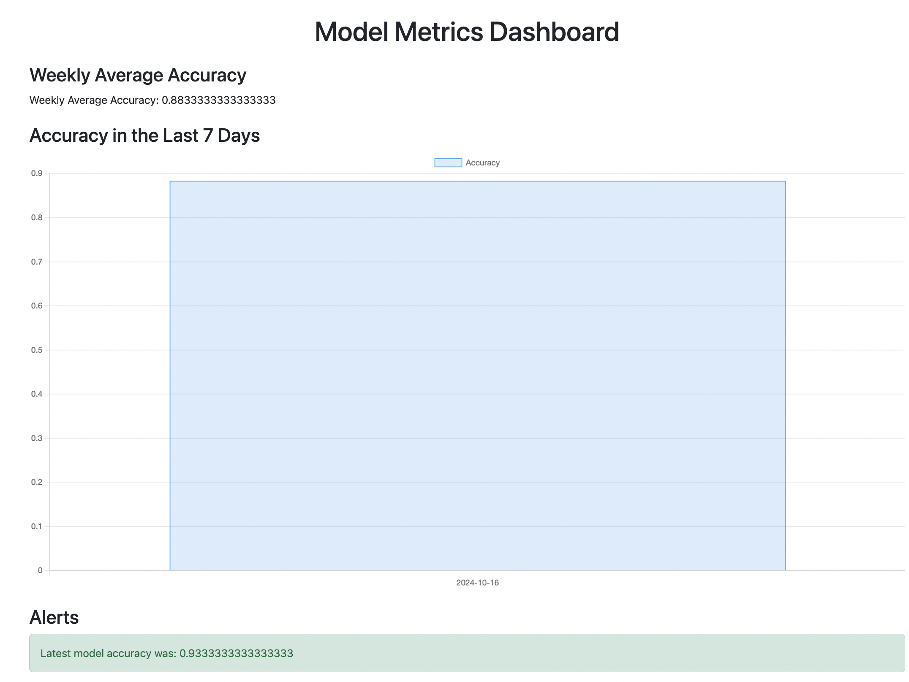
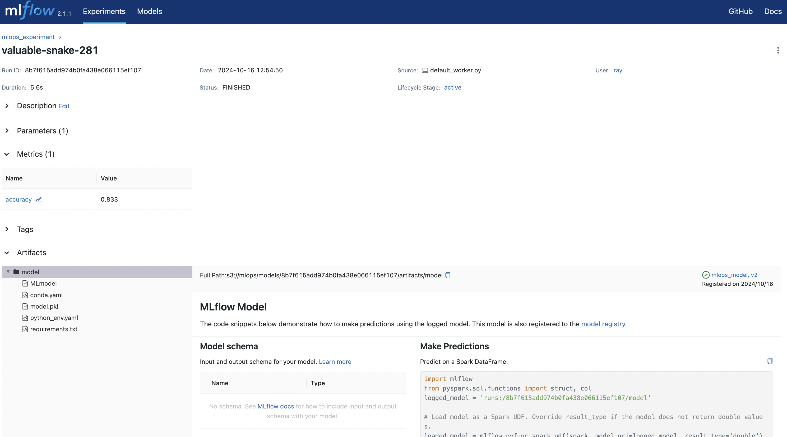
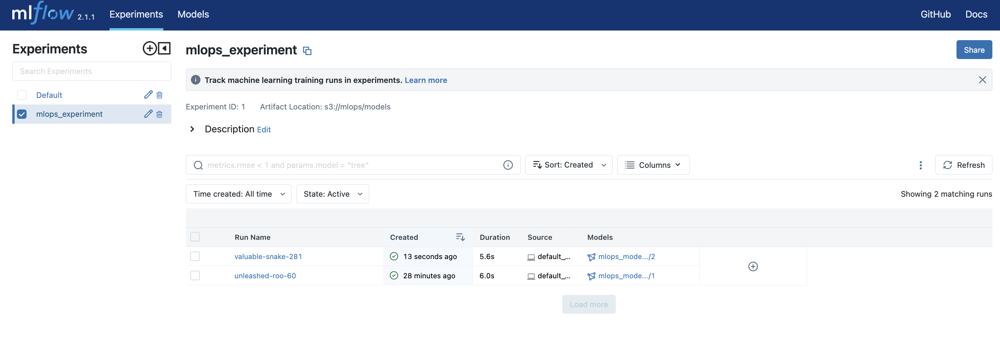
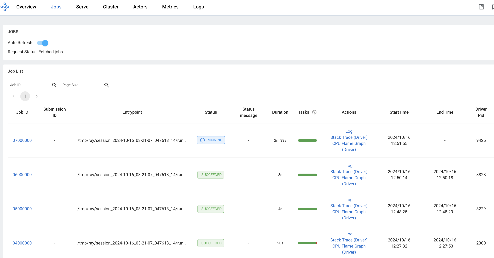
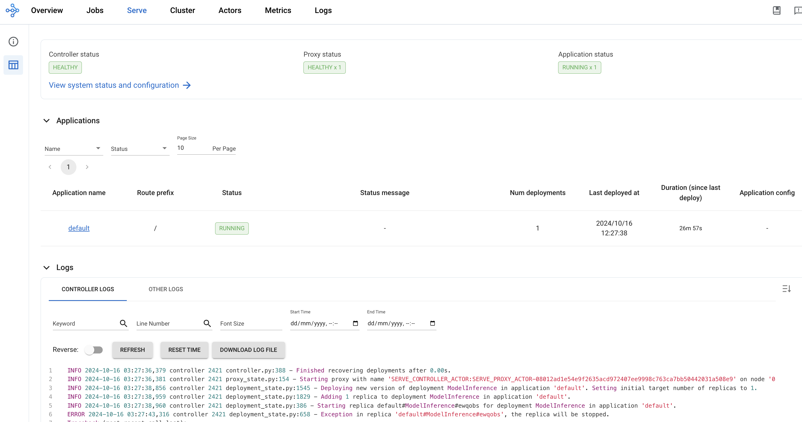

# MLOps Infrastructure with Kubernetes, Helm, ArgoCD, and Ray

<p align="center">
  
  
</p>

---

`Note: Infrastructure is tested and built only for arm64 system. Live application uses an arm64 EC2 Ubuntu machine`

---

### Live Application

Sample data is already loaded into `s3://mlops/data/` at the Minio URL

*   [ArgoCD DASHBOARD](http://ec2-3-73-69-105.eu-central-1.compute.amazonaws.com:8081): View FastAPI Deployment `user/pass: admin/bs8uLQfG1EmlWfj-`
*   [MLFlow DASHBOARD](http://ec2-3-73-69-105.eu-central-1.compute.amazonaws.com:5556): View ML model details
*   [Frontend App](http://ec2-3-73-69-105.eu-central-1.compute.amazonaws.com:5002): Visualise Metrics and Get Alerts
*   [Ray DASHBOARD](http://ec2-3-73-69-105.eu-central-1.compute.amazonaws.com:8266): View Training/Serving Jobs
*   [Minio UI](http://ec2-3-73-69-105.eu-central-1.compute.amazonaws.com:9002): S3 Replica `user/pass: virtualminds/virtualminds`
*   [FastAPI Swagger Endpoints](http://ec2-3-73-69-105.eu-central-1.compute.amazonaws.com:8889/docs): Interact With Endpoints

## Overview

This repository provides an end-to-end MLOps infrastructure setup, automating the deployment of a Kubernetes cluster using KIND (Kubernetes in Docker) and deploying various services such as FastAPI, KubeRay, ArgoCD, MinIO, MLflow, and more. The infrastructure is designed to support machine learning workflows, including model training, deployment, monitoring, and serving, using tools like Ray, MLflow, and MinIO.

## Architecture

<p align="center">
  
  <p align="center">Click To Expand</p>
</p>

## Features

*   **Automated Cluster Setup**: Automated creation and configuration of a KIND Kubernetes cluster on Mac M2 chip.
*   **Containerized Applications**: Dockerized FastAPI application and frontend for model training and inference.
*   **Distributed Computing**: Integration with Ray and KubeRay for distributed computing and model serving.
*   **CI/CD with ArgoCD**: Continuous integration and deployment using ArgoCD for application deployment.
*   **Object Storage with MinIO**: MinIO deployed as an S3-compatible object storage for data and model artifacts.
*   **Experiment Tracking with MLflow**: MLflow for tracking experiments, model registry, and model management.
*   **Monitoring and Alerts**: Redis and frontend application for monitoring metrics and sending alerts.
*   **Pydantic Models**: Defined Pydantic models for request validation in the FastAPI application.
*   **Nginx App**: Single page application to view model performance and monitor alerts

## Technologies Used

*   **Kubernetes**: Orchestrates containerized applications.
*   **KIND (Kubernetes in Docker)**: Runs Kubernetes clusters locally using Docker containers.
*   **Helm**: Manages Kubernetes applications using Helm charts.
*   **ArgoCD**: Implements GitOps continuous delivery for Kubernetes.
*   **Ray and KubeRay**: Provides distributed computing capabilities for Python.
*   **FastAPI**: Web framework for building APIs.
*   **MLflow**: Manages the ML lifecycle, including experimentation, reproducibility, and deployment.
*   **MinIO**: High-performance, S3-compatible object storage.
*   **Redis**: Acts as a message broker for server-sent events (SSE) in the FastAPI application, used as a message queue for alerts
*   **Docker**: Containerization platform for applications.

## Infrastructure and Deployment

### Deployment Steps

The `init.sh` script automates the deployment process. Below are the detailed steps performed by the script:

1.  **Create and Configure KIND Cluster**
    
    *   Checks if a KIND cluster named `kind-cluster` exists; if not, it creates one using the configuration in `config/kind-config.yaml`.
    *   Sets the Kubernetes context to the new cluster.
2.  **Set Up Namespaces**
    
    *   Applies the namespaces configuration from `manifests/namespaces.yaml`.
3.  **Configure Kubernetes Dashboard**
    
    *   Deploys the Kubernetes dashboard for cluster management.
    *   Creates an admin user and retrieves the access token.
4.  **Add Helm Repositories**
    
    *   Adds necessary Helm repositories for ArgoCD, KubeRay, MinIO, MLflow, Nginx, Redis
    *   Updates the Helm repositories.
5.  **Build and Load Docker Images**
    
    *   Builds Docker images for the FastAPI application and the frontend (nginx).
    *   Loads these images into the KIND cluster.
6.  **Create Secrets**
    
    *   Creates Kubernetes secrets for MinIO credentials in the `fastapi` and `mlflow` namespaces.
7.  **Install ArgoCD**
    
    *   Installs ArgoCD via Helm in the `argocd` namespace using custom Helm values.
    *   Waits for ArgoCD to be ready and forwards its service port to localhost.
8.  **Install MLflow**
    
    *   Installs MLflow via Helm in the `mlflow` namespace using custom Helm values.
    *   Sets environment variables for MLflow to connect to MinIO.
9.  **Deploy Frontend Application**
    
    *   Deploys the frontend application using nginx.
    *   Javascript events to listen to webhooks (FastAPI endpoint) `/webhook`
10.  **Install KubeRay Operator and Cluster**
    
      *   Installs KubeRay operator and Ray cluster via Helm in the `kuberay` namespace.
11.  **Install Redis**
    
     *   Installs Redis via Helm in the `db` namespace using custom Helm values.
     *   Forwards Redis service port to localhost.
12.  **Install MinIO**
    
     *   Creates secrets for MinIO access and root users.
     *   Installs MinIO via Helm in the `minio` namespace using custom Helm values.
13.  **Deploy FastAPI Application Using ArgoCD**
    
     *   Applies the ArgoCD application manifest to deploy the FastAPI application from the Git repository.

## Pydantic Models

The FastAPI application uses Pydantic models for request validation. The models are defined as follows:

*   **ScheduleTrainingRequest**
```
class ScheduleTrainingRequest(BaseModel):
	minutes: int
	hyperparameters: Dict[str, Any]
```
    
*   **InferenceRequest**
```
class InferenceRequest(BaseModel):
	input_data: List[float]
	model_version: Optional[str] = None
	retries: Optional[int] = 3
	sla_seconds: Optional[int] = 60
```
    
*   **TrainingRequest**
 ```
class TrainingRequest(BaseModel):     
	hyperparameters: Dict[str, Any]
```
*   **WatchModelRequest**
``` 
class WatchModelRequest(BaseModel):
	minutes: int
```

These models ensure that the API endpoints receive the expected data types and structures.

## How To Use The App

### Accessing the Services

After running the `init.sh` script, various services are accessible via localhost ports:

*   **Kubernetes Dashboard**: [http://localhost:8001](http://localhost:8001)
*   **ArgoCD Dashboard**: [http://localhost:8080](http://localhost:8080)
*   **MLflow UI**: [http://localhost:5555](http://localhost:5555)
*   **Ray Dashboard**: [http://localhost:8265](http://localhost:8265)
*   **Redis Endpoint**: [http://localhost:6379](http://localhost:6379)
*   **MinIO Console**: [http://localhost:9001](http://localhost:9001)
*   **Frontend App**: [http://localhost:5001](http://localhost:5001)
*   **FastAPI Swagger Docs**: [http://localhost:8888/docs](http://localhost:8888/docs)

### Required Step For Training Model 

Log into MinIO Console and create a bucket `mlops`. Inside the bucket, create a folder `data` and upload `iris.csv`. Complete path is hardcoded in the application: `s3://mlops/data/iris.csv`

### Required Step For Serving Model 

Once a model is trained and visible in MLFlow UI, it is not automatically available for inference. Please run this command to start the model serving using ray using `serve.py`

```
kubectl exec -it {any-fastapi-pod-name} -n fastapi -- python /var/task/fastapi/serve.py
```
### FastAPI Endpoints

The FastAPI application provides several endpoints:

*   **`/trigger_training`**: Triggers a model training job.
*   **`/inference`**: Performs model inference. (Required to run `serve.py` before invoking)
*   **`/schedule_training`**: Schedules periodic model training.
*   **`/watch_model`**: Watches the model for updates and sends alerts. Useful to know if model hasn't been trained for `n` minutes
*   **`/kill_scheduled_job/{job_id}`**: Cancels a scheduled job.
*   **`/get_metrics`**: Retrieves metrics for the latest model and averages of past week
*   **`/webhook`**: Server-Sent Events endpoint for real-time updates.

### Training a Model

To trigger model training, send a POST request to `/trigger_training` with the desired hyperparameters.

Example payload:
```
{   
	"hyperparameters": {
	"n_estimators": 100,
	"max_depth": 5
	}
}
```

### Performing Inference

To perform inference, send a POST request to `/inference` with the input data.

Example payload:
```
{   
	"input_data": [0.1, 1.2, 2.3, 2.2]
}
```

### Scheduling Training

To schedule periodic training, send a POST request to `/schedule_training` with the interval in minutes and hyperparameters.

Example payload:
```
{
	"minutes": 10,
	"hyperparameters": {
		"n_estimators": 100,
		"max_depth": 5
	}
}
```

### Watching the Model

To monitor the model for updates, send a POST request to `/watch_model` with the interval in minutes.

Example payload:

`{"minutes": 10}`

### Accessing Metrics

To retrieve model metrics, send a GET request to `/get_metrics`.

## Deploying the Application Locally

### Prerequisites

Ensure you have the following tools installed on your Mac M2:

*   **Homebrew**: Package manager for macOS.
*   **Docker**: For running containers.
*   **Kubernetes CLI (kubectl)**: For interacting with Kubernetes clusters.
*   **Helm**: Package manager for Kubernetes.
*   **Kind**: Tool for running local Kubernetes clusters using Docker containers.
*   **Git**: Version control system.

#### Install Homebrew

If you don't have Homebrew installed, run:
```
/bin/bash -c "$(curl -fsSL https://raw.githubusercontent.com/Homebrew/install/HEAD/install.sh)"
```

#### Install Required Tools

Install the necessary tools using Homebrew:

`brew install kubectl helm kind docker git`

### Running the `init.sh` Script
```   
git clone https://github.com/yourusername/yourrepository.git 
cd yourrepository
chmod +x init.sh
./config/init.sh
```

### Accessing the Applications

After the script completes, you can access the services as described in the **How To Use The App** section.

### Notes

*   **Port Forwarding**: The script sets up port forwarding for various services. Ensure that the ports are not in use by other applications. View `outputs/urls.txt`
    
*   **Credentials**: Access credentials for ArgoCD, MLflow, and MinIO are stored in `outputs/credentials.txt`.
    
*   **Cleanup**: To delete the cluster and resources, you can use the following commands:
    
    `kind delete cluster --name kind-cluster`
    

## Explanation of Service Interconnections

### FastAPI Application

*   **Purpose**: Acts as the main API interface for triggering training jobs, performing inference, scheduling tasks, and monitoring models.
*   **Interconnections**:
    *   **Ray**: Utilizes Ray for distributed model training and inference tasks.
    *   **MLflow**: Interacts with MLflow for experiment tracking and model registry.
    *   **MinIO**: Loads data and stores model artifacts in MinIO (S3-compatible storage).
    *   **Redis**: Uses Redis as a message queue for server-sent events (SSE) to notify the frontend application.

### Ray and KubeRay

*   **Purpose**: Provides distributed computing capabilities for efficient model training and inference.
*   **Interconnections**:
    *   **FastAPI**: The FastAPI application submits training and inference tasks to the Ray cluster.
    *   **Serve**: Ray Serve is used to deploy and serve models for inference.

### MLflow

*   **Purpose**: Tracks machine learning experiments, logs metrics, and manages model versions.
*   **Interconnections**:
    *   **FastAPI**: The application logs metrics and models to MLflow.
    *   **MinIO**: Stores model artifacts in MinIO.
    *   **Ray**: The training jobs running on Ray interact with MLflow for logging.

### MinIO

*   **Purpose**: Acts as an S3-compatible object storage for datasets and model artifacts.
*   **Interconnections**:
    *   **FastAPI**: Loads datasets from MinIO and saves model artifacts.
    *   **MLflow**: Uses MinIO as the backend storage for artifacts.

### Redis

*   **Purpose**: Serves as a message queue for server-sent events (SSE) notifications.
*   **Interconnections**:
    *   **FastAPI**: Publishes messages to Redis for events like model training completion or alerts.
    *   **Frontend**: Subscribes to Redis to receive and display alerts and metrics.

### ArgoCD

*   **Purpose**: Implements GitOps continuous delivery, automating the deployment of the FastAPI application from the Git repository.
*   **Interconnections**:
    *   **Kubernetes**: Manages the deployment of the FastAPI application to the cluster. The manifest is pulled from GIT `https://github.com/purijs/mlops`
    *   **Git Repository**: Monitors the repository for changes and synchronizes the application state.

### Frontend Application

*   **Purpose**: Provides a web interface for visualizing metrics and receiving alerts.
*   **Interconnections**:
    *   **Redis**: Subscribes to messages for displaying alerts.
    *   **FastAPI**: May interact with FastAPI endpoints to fetch metrics.

Sample GIT workflows are integrated for connecting building of Docker files for integration with ArgoCD pipeline

---

## Screenshots

*  ArgoCD showing FastAPI deplyoment
<p align="center">
  
  
</p>

*  Model artifacts on Minio (S3)
<p align="center">
  
  
</p>

*  Frontend Alert: Model not trained for `x` minutes
<p align="center">
  
  
</p>

*  Frontend Alert: Model achieves more than 90% accuracy
<p align="center">
  
  
</p>

*  MLFlow Model Logging
<p align="center">
  
  
</p>

*  MLFlow Experiment Logging
<p align="center">
  
  
</p>

*  Ray Jobs
<p align="center">
  
  
</p>

*  Ray Serve (Model Inference)
<p align="center">
  
  
</p>
